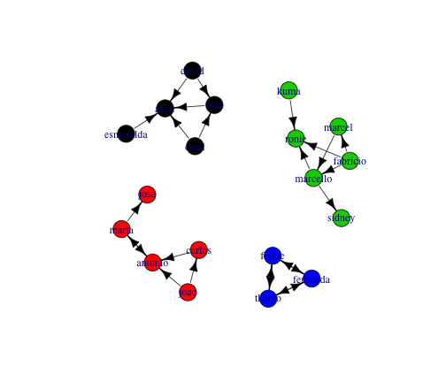
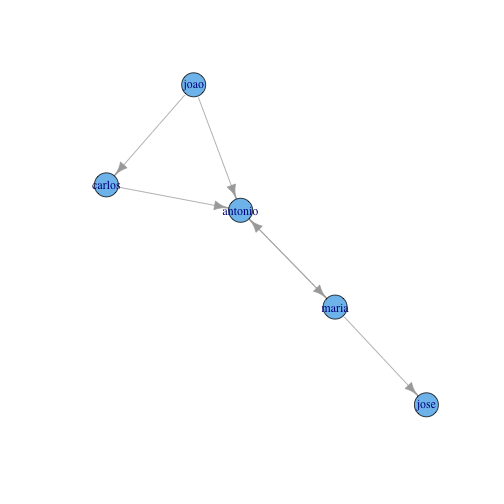
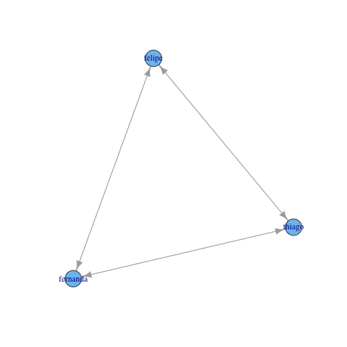

Análise de comunidades
========================================================

O objetivo deste documento é exemplificar o cálculo de atributos de redes sociais. Os exemplos foram implementados utilizando a linguagem de programação *R* e o pacote *igraph* (http://igraph.org/r/doc/).


```r
library(igraph)
relacoes <- read.csv("../data//relacoes.csv", sep = ";")
g <- graph.data.frame(relacoes, directed = TRUE)
```


O grafo didático criado possui a seguinte estrutura:


```r
plot(g, layout = layout.kamada.kawai, edge.width = E(g)$weight, edge.color = "black")
```

 


As comunidades deste grafo são:


```r
cl <- clusters(g)
quantidade_clusters <- cl$no
quantidade_clusters
```

```
## [1] 4
```


```r
plot(g, layout = layout.kamada.kawai, edge.width = E(g)$width, edge.color = "black", 
    vertex.color = cl$membership)
```

 


Comunidade 1
------------


```r
g_local <- induced.subgraph(g, V(g)[cl$membership == 1])
plot(g_local)
```

 


```r
vcount(g_local)
```

```
## [1] 5
```

```r
ecount(g_local)
```

```
## [1] 6
```

```r
is.connected(g_local)
```

```
## [1] TRUE
```


```r
diam <- diameter(g_local)
diam
```

```
## [1] 1
```

```r
nodes <- farthest.nodes(g_local)
nodes
```

```
## [1] 1 5 1
```

```r
V(g_local)[nodes[1]]
```

```
## Vertex sequence:
## [1] "bob"
```

```r
V(g_local)[nodes[2]]
```

```
## Vertex sequence:
## [1] "alice"
```


```r
degree(g_local, mode = "in")
```

```
##       bob     cecil     david esmeralda     alice 
##         2         0         0         0         4
```

```r
degree(g_local, mode = "out")
```

```
##       bob     cecil     david esmeralda     alice 
##         1         2         2         1         0
```

```r
degree(g_local, mode = "all")
```

```
##       bob     cecil     david esmeralda     alice 
##         3         2         2         1         4
```

```r
betweenness(g_local, directed = TRUE)
```

```
##       bob     cecil     david esmeralda     alice 
##         0         0         0         0         0
```


```r
reciprocity(g_local)
```

```
## [1] 0
```


```r
authority.score(g_local)$vector
```

```
##       bob     cecil     david esmeralda     alice 
## 6.180e-01 6.526e-17 6.526e-17 3.263e-17 1.000e+00
```

```r
hub.score(g_local)$vector
```

```
##       bob     cecil     david esmeralda     alice 
## 6.180e-01 1.000e+00 1.000e+00 6.180e-01 3.692e-16
```

```r
page.rank(g_local)$vector
```

```
##       bob     cecil     david esmeralda     alice 
##    0.2028    0.1096    0.1096    0.1096    0.4683
```


Comunidade 2
------------


```r
g_local <- induced.subgraph(g, V(g)[cl$membership == 2])
plot(g_local)
```

 


```r
vcount(g_local)
```

```
## [1] 5
```

```r
ecount(g_local)
```

```
## [1] 6
```

```r
is.connected(g_local)
```

```
## [1] TRUE
```


```r
diam <- diameter(g_local)
diam
```

```
## [1] 3
```

```r
nodes <- farthest.nodes(g_local)
nodes
```

```
## [1] 1 5 3
```

```r
V(g_local)[nodes[1]]
```

```
## Vertex sequence:
## [1] "carlos"
```

```r
V(g_local)[nodes[2]]
```

```
## Vertex sequence:
## [1] "jose"
```


```r
degree(g_local, mode = "in")
```

```
##  carlos   maria    joao antonio    jose 
##       1       1       0       3       1
```

```r
degree(g_local, mode = "out")
```

```
##  carlos   maria    joao antonio    jose 
##       1       2       2       1       0
```

```r
degree(g_local, mode = "all")
```

```
##  carlos   maria    joao antonio    jose 
##       2       3       2       4       1
```

```r
betweenness(g_local, directed = TRUE)
```

```
##  carlos   maria    joao antonio    jose 
##       0       3       0       4       0
```


```r
reciprocity(g_local)
```

```
## [1] 0.3333
```


```r
authority.score(g_local)$vector
```

```
##  carlos   maria    joao antonio    jose 
##   0.366   0.000   0.000   1.000   0.366
```

```r
hub.score(g_local)$vector
```

```
##    carlos     maria      joao   antonio      jose 
## 7.321e-01 1.000e+00 1.000e+00 0.000e+00 2.865e-17
```

```r
page.rank(g_local)$vector
```

```
##  carlos   maria    joao antonio    jose 
## 0.09225 0.32845 0.06474 0.31025 0.20432
```


Comunidade 3
------------


```r
g_local <- induced.subgraph(g, V(g)[cl$membership == 3])
plot(g_local)
```

 


```r
vcount(g_local)
```

```
## [1] 6
```

```r
ecount(g_local)
```

```
## [1] 7
```

```r
is.connected(g_local)
```

```
## [1] TRUE
```


```r
diam <- diameter(g_local)
diam
```

```
## [1] 2
```

```r
nodes <- farthest.nodes(g_local)
nodes
```

```
## [1] 3 5 2
```

```r
V(g_local)[nodes[1]]
```

```
## Vertex sequence:
## [1] "marcel"
```

```r
V(g_local)[nodes[2]]
```

```
## Vertex sequence:
## [1] "ronie"
```


```r
degree(g_local, mode = "in")
```

```
## marcello     kuma   marcel fabricio    ronie   sidney 
##        2        0        1        0        3        1
```

```r
degree(g_local, mode = "out")
```

```
## marcello     kuma   marcel fabricio    ronie   sidney 
##        2        1        1        3        0        0
```

```r
degree(g_local, mode = "all")
```

```
## marcello     kuma   marcel fabricio    ronie   sidney 
##        4        1        2        3        3        1
```

```r
betweenness(g_local, directed = TRUE)
```

```
## marcello     kuma   marcel fabricio    ronie   sidney 
##        3        0        0        0        0        0
```


```r
reciprocity(g_local)
```

```
## [1] 0
```


```r
authority.score(g_local)$vector
```

```
##  marcello      kuma    marcel  fabricio     ronie    sidney 
## 6.180e-01 1.133e-17 4.773e-01 8.934e-17 1.000e+00 2.950e-01
```

```r
hub.score(g_local)$vector
```

```
## marcello     kuma   marcel fabricio    ronie   sidney 
##   0.6180   0.4773   0.2950   1.0000   0.0000   0.0000
```

```r
page.rank(g_local)$vector
```

```
## marcello     kuma   marcel fabricio    ronie   sidney 
##  0.21965  0.09252  0.11873  0.09252  0.29072  0.18587
```


Comunidade 4
------------


```r
g_local <- induced.subgraph(g, V(g)[cl$membership == 4])
plot(g_local)
```

 


```r
vcount(g_local)
```

```
## [1] 3
```

```r
ecount(g_local)
```

```
## [1] 6
```

```r
is.connected(g_local)
```

```
## [1] TRUE
```


```r
diam <- diameter(g_local)
diam
```

```
## [1] 1
```

```r
nodes <- farthest.nodes(g_local)
nodes
```

```
## [1] 1 2 1
```

```r
V(g_local)[nodes[1]]
```

```
## Vertex sequence:
## [1] "thiago"
```

```r
V(g_local)[nodes[2]]
```

```
## Vertex sequence:
## [1] "felipe"
```


```r
degree(g_local, mode = "in")
```

```
##   thiago   felipe fernanda 
##        2        2        2
```

```r
degree(g_local, mode = "out")
```

```
##   thiago   felipe fernanda 
##        2        2        2
```

```r
degree(g_local, mode = "all")
```

```
##   thiago   felipe fernanda 
##        4        4        4
```

```r
betweenness(g_local, directed = TRUE)
```

```
##   thiago   felipe fernanda 
##        0        0        0
```


```r
reciprocity(g_local)
```

```
## [1] 1
```


```r
authority.score(g_local)$vector
```

```
##   thiago   felipe fernanda 
##        1        1        1
```

```r
hub.score(g_local)$vector
```

```
##   thiago   felipe fernanda 
##        1        1        1
```

```r
page.rank(g_local)$vector
```

```
##   thiago   felipe fernanda 
##   0.3333   0.3333   0.3333
```

