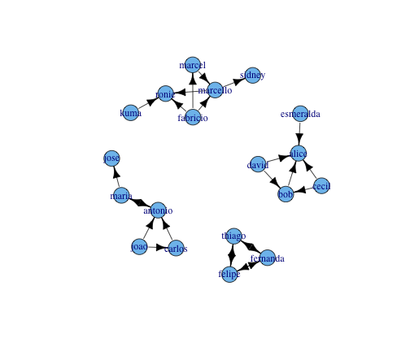
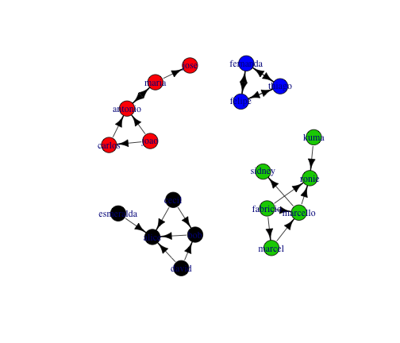

Pequeno exemplo sobre Análise de Redes Sociais (evolução 1)
========================================================

O objetivo deste documento é exemplificar o cálculo de atributos de redes sociais. Os exemplos foram implementados utilizando a linguagem de programação *R* e o pacote *igraph* (http://igraph.org/r/doc/).


```r
library(igraph)
relacoes <- read.csv("../data//relacoes_evol1.csv", sep = ";")
g <- graph.data.frame(relacoes, directed = TRUE)
```


O grafo didático criado possui a seguinte estrutura:


```r
plot(g, layout = layout.kamada.kawai, edge.width = E(g)$weight, edge.color = "black")
```

 


```r
qtd_vertice <- vcount(g)
qtd_vertice
```

```
## [1] 16
```

```r
qtd_aresta <- ecount(g)
qtd_aresta
```

```
## [1] 21
```

```r
is.connected(g)
```

```
## [1] TRUE
```


O grafo possui 16 nodos, 21 arestas e não é conectado.

O _longest path_ do grafo e os nodos que estão mais longe entre si são apresentados abaixo:


```r
diam <- diameter(g)
diam
```

```
## [1] 3
```

```r
nodes <- farthest.nodes(g)
nodes
```

```
## [1]  5 14  3
```

```r
V(g)[nodes[1]]
```

```
## Vertex sequence:
## [1] "carlos"
```

```r
V(g)[nodes[2]]
```

```
## Vertex sequence:
## [1] "jose"
```


Um atributo utilizado para medir a eficiência do tráfego de informação de uma rede é o _average path length_.
_average path length_ é definido como o número médio de passos entre os menores caminhos para todos os pares
de nodos possíveis na rede. Quanto menor este número, maior é a eficiência do tráfego de informação na rede.

Podemos calcular o _average path length_ de duas formas:

* considerando apenas o comprimento dos caminhos existentes:


```r
aver_path <- average.path.length(g, directed = TRUE, unconnected = TRUE)
aver_path
```

```
## [1] 1.698
```


* considerando também os caminhos faltantes. Neste caso, considera-se o tamanho de um caminho faltante como sendo _vcount(graph)_. 


```r
aver_path <- average.path.length(g, directed = TRUE, unconnected = FALSE)
aver_path
```

```
## [1] 13.44
```


O número de seguidores (in-degree), o número de seguidos (out-degree) e o número de conexões de uma pessoa podem ser facilmente calculados da seguinte forma:


```r
degree(g, mode = "in")
```

```
##       bob     cecil     david esmeralda    carlos     maria      joao 
##         2         0         0         0         1         1         0 
##  marcello      kuma    marcel  fabricio   antonio     alice      jose 
##         3         0         1         0         3         5         1 
##     ronie    sidney 
##         3         1
```

```r
degree(g, mode = "out")
```

```
##       bob     cecil     david esmeralda    carlos     maria      joao 
##         1         2         2         1         1         2         2 
##  marcello      kuma    marcel  fabricio   antonio     alice      jose 
##         2         1         1         3         3         0         0 
##     ronie    sidney 
##         0         0
```

```r
degree(g, mode = "all")
```

```
##       bob     cecil     david esmeralda    carlos     maria      joao 
##         3         2         2         1         2         3         2 
##  marcello      kuma    marcel  fabricio   antonio     alice      jose 
##         5         1         2         3         6         5         1 
##     ronie    sidney 
##         3         1
```


Betweenness is a centrality measure of a vertex within a graph (there is also edge betweenness, which is not discussed here). Betweenness centrality quantifies the number of times a node acts as a bridge along the shortest path between two other nodes. It was introduced as a measure for quantifying the control of a human on the communication between other humans in a social network by Linton Freeman[16] In his conception, vertices that have a high probability to occur on a randomly chosen shortest path between two randomly chosen vertices have a high betweenness.

Betweenness centrality is an indicator of a node's centrality in a network. It is equal to the number of shortest paths from all vertices to all others that pass through that node.  Betweenness centrality is a more useful measure (than just connectivity) of both the load and importance of a node.


```r
betweenness <- betweenness(g, directed = TRUE)
which.max(betweenness)
```

```
## antonio 
##      12
```

```r
which.min(betweenness)
```

```
## bob 
##   1
```


A _reciprocity_ de um usuário é calculado como $R(x) = \frac{|Out(x) \in In(x)|}{|Out(x)|}$ onde $Out(x)$ é o conjunto de usuários que o usuário $x$ segue e $In(x)$ é o conjunto de usuários que segue $x$. _Reciprocity_ mede a probabilidade de um usuário ser seguido por usuários que ele segue.


```r
# estah me retornando a reciprocity do grafo.  ver como retornar o valor
# para cada usuário.
reciprocity(g)
```

```
## [1] 0.09524
```


A _assortativity_ de um nodo é definido como a razão entre o (in/out) degree e a média do (in/out) degree dos seus vizinhos. Podemos calcular a _assortativity_ para quatro tipos de degree-degree correlação (i.e., in-in, in-out, out-in e out-out).


```r
assortativity.degree(g)
```

```
## [1] -0.2759
```


Autoridades e hubs:


```r
authority_values <- authority.score(g)$vector
authority_values
```

```
##       bob     cecil     david esmeralda    carlos     maria      joao 
## 4.386e-01 1.435e-17 1.435e-17 7.175e-18 0.000e+00 2.566e-01 1.435e-17 
##  marcello      kuma    marcel  fabricio   antonio     alice      jose 
## 4.266e-01 7.175e-18 1.050e-01 3.176e-17 0.000e+00 1.000e+00 0.000e+00 
##     ronie    sidney 
## 1.573e-01 2.828e-02
```

```r
which.max(authority_values)
```

```
## alice 
##    13
```

```r
which.min(authority_values)
```

```
## carlos 
##      5
```

```r
hub_values <- hub.score(g)$vector
hub_values
```

```
##       bob     cecil     david esmeralda    carlos     maria      joao 
## 5.941e-01 8.547e-01 8.547e-01 5.941e-01 0.000e+00 0.000e+00 0.000e+00 
##  marcello      kuma    marcel  fabricio   antonio     alice      jose 
## 1.102e-01 9.343e-02 2.535e-01 4.093e-01 1.000e+00 1.087e-17 0.000e+00 
##     ronie    sidney 
## 3.882e-17 0.000e+00
```

```r
which.max(hub_values)
```

```
## antonio 
##      12
```

```r
which.min(hub_values)
```

```
## carlos 
##      5
```


Pagerank:


```r
page_rank_values <- page.rank(g)$vector
page_rank_values
```

```
##       bob     cecil     david esmeralda    carlos     maria      joao 
##   0.05696   0.03079   0.03079   0.03079   0.04388   0.06115   0.03079 
##  marcello      kuma    marcel  fabricio   antonio     alice      jose 
##   0.10347   0.03079   0.03951   0.03079   0.10716   0.16192   0.05678 
##     ronie    sidney 
##   0.10966   0.07476
```

```r
which.max(page_rank_values)
```

```
## alice 
##    13
```

```r
which.min(page_rank_values)
```

```
## cecil 
##     2
```


Clusters
--------


```r
cl <- clusters(g)
quantidade_clusters <- cl$no
quantidade_clusters
```

```
## [1] 1
```


```r
plot(g, layout = layout.kamada.kawai, edge.width = E(g)$width, edge.color = "black", 
    vertex.color = cl$membership)
```

 

